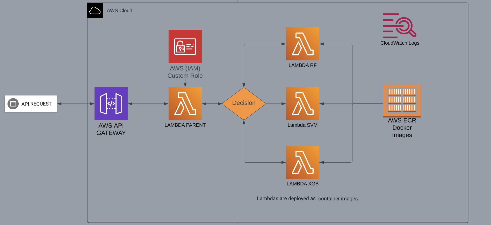

## MLOPS Challenge
Objective: build and deploy a Machine learning model for user recognition based on keystroke data and is consists of 2 separate parts.

### Part 1 – Building Models
Details about building models can be found in the this [Link notebook](training/TF%20MLOPs%20challenge.ipynb)
 
### Part 2- Deploying Models

<ol>
    <li>Payload is sent to AWS API GATEWAY.</li>
    <li>API GATEWAY Invokes the Parent Lambda Function, it passes the payload.</li>
    <li>Parent Lambda function receives the payload, it checks which model needs to be used from the payload.</li>
    <li>Parent Lambda function invokes the correct child lambda function(Child Lambdas are SF, RF, XGB) and sends the payload it received.</li>
    <li>Child Lambda function receives the payload and do the following:
    <ol type="a">
            <li>load the model</li>
            <li>extract the features from the payload</li>
            <li>sends the model’s prediction back to Parent Lambda function.</li>
        </ol>
    </li>
    <li>Parent lambda function receives the response from child lambda and sends the results to APIGATEWAY.</li>
    <li>API GATEWAY sends back the response to client.</li>
</ol>

### REST API
REST_API_Parent_Child_Lambdas: https://9t3cvckvk0.execute-api.us-east-1.amazonaws.com/Dev_v1

