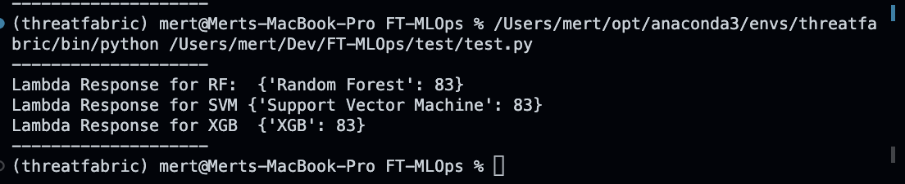

## MLOPS Challenge
<strong>Objective:</strong> Build and deploy a Machine learning model for user recognition based on keystroke data and is consists of 2 separate parts.

### Part 1 – Building Models
Details about building models can be found in the this [notebook](training/TF%20MLOPs%20challenge.ipynb).

### Part 2- Deploying Models
All the necessary code is in [this directory](ParentChildsLambdas).

<ol>
    <li>Payload is sent to AWS API GATEWAY.</li>
    <li>API GATEWAY Invokes the Parent Lambda Function, it passes the payload.</li>
    <li>Parent Lambda function receives the payload, it checks which model needs to be used from the payload.</li>
    <li>Parent Lambda function invokes the correct child lambda function(Child Lambdas are SF, RF, XGB) and sends the payload it received.</li>
    <li>Child Lambda function receives the payload and do the following:
    <ol type="a">
            <li>Load the model.</li>
            <li>Extract the features from the payload.</li>
            <li>Sends the model’s prediction back to Parent Lambda function.</li>
        </ol>
    </li>
    <li>Parent lambda function receives the response from child lambda and sends the results to APIGATEWAY.</li>
    <li>API GATEWAY sends back the response to client.</li>
</ol>

### REST API
Rest API : https://9t3cvckvk0.execute-api.us-east-1.amazonaws.com/Dev_v1

### Further Implementation (Can be done to make the system more robust)
- Better error handling should be implemented. When Lambda Fails(wrong input), it returns the whole error stack, it shouldn't be that way.
- Create a VPC for Lambda functions.
- Step Functions can be used instead of having a lambda to handle requests.
- S3 Bucket could be used to load Random Forest Model.
